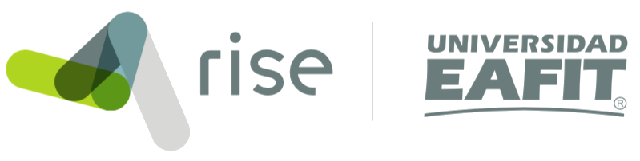
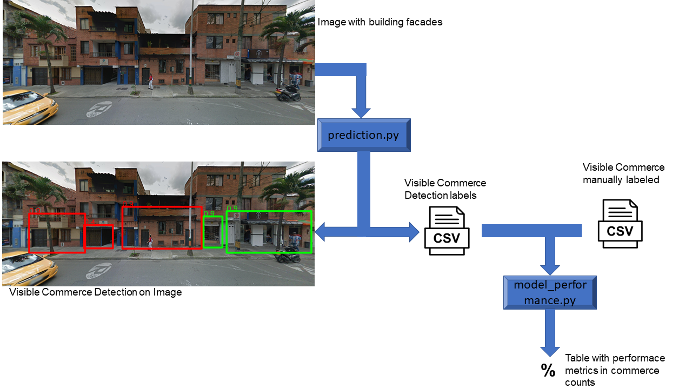

DEtection Transformer for Commerce
=================================================


## Description

This repository contains the data and the code used in the implementation of the DETR for the detection of businesses visible in street images:


Juan C. Saldarriaga<sup>1</sup>

<sup>1</sup> RiSE-group, Department of Mathematical Sciences, Universidad EAFIT, Medellin, Colombia

__maintainer__ = "RiSE Group"  (http://www.rise-group.org/). Universidad EAFIT

__Corresponding author__ = jduquec1@eafit.edu.co (JCD)




```
# PREDICCIÓN
python prediction.py --fg_folder=best_model 
                     --score_th=0.1
                     --folder_images=data/tuning/
                     --output_directory=predictions/prediction_tuning_best_model.csv
                     
# RENDIMIENTO
python model_performance.py --prediction_folder=predictions/prediction_tuning_best_model
                            --labels_file = data/tuning_labels.csv
                            --score_th=0.1
                            --IOU_th = 0.45
```
